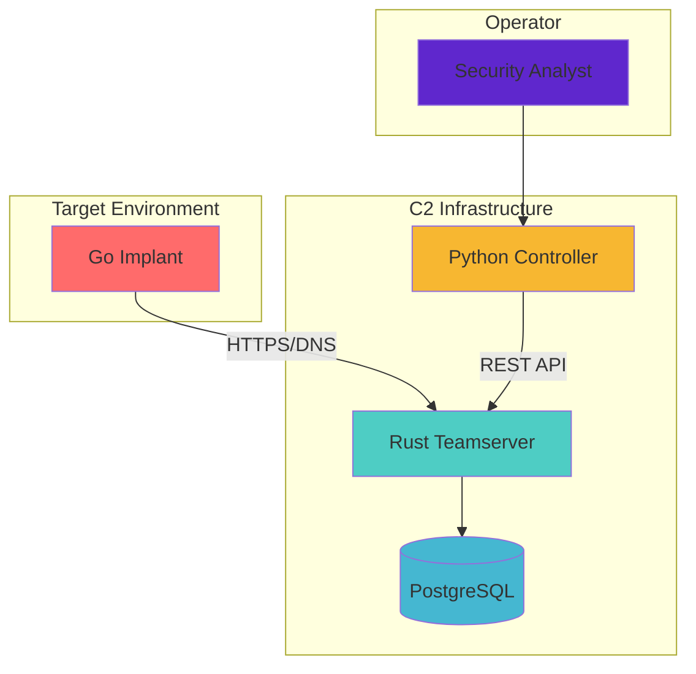
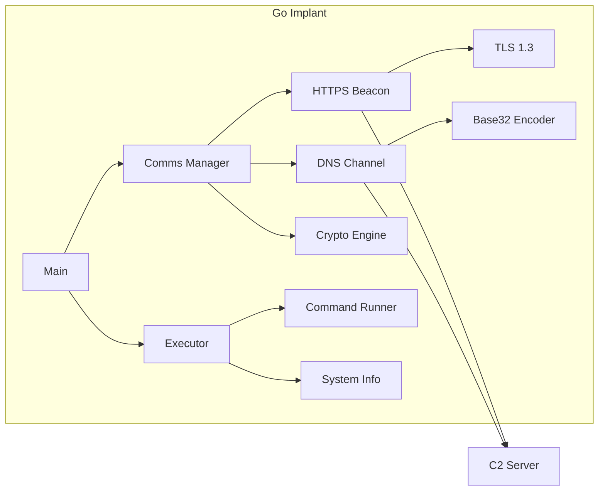
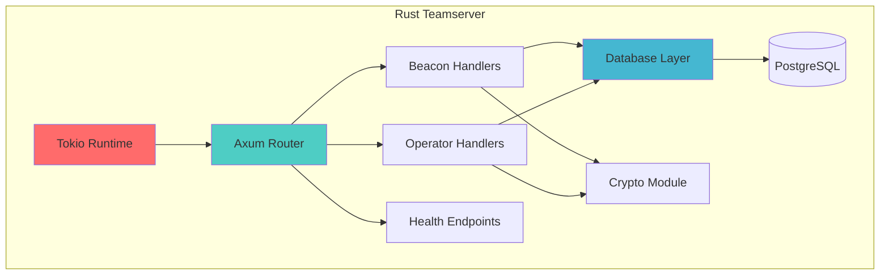
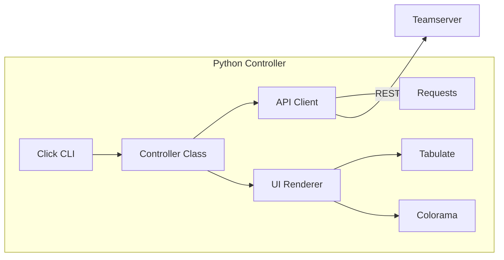
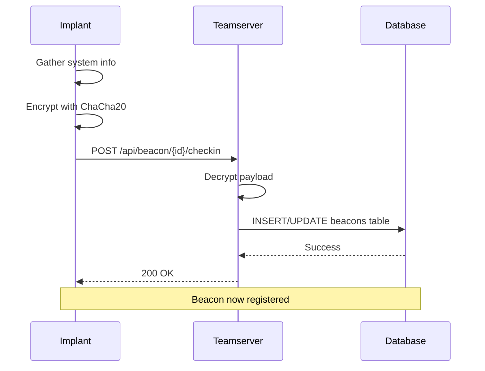
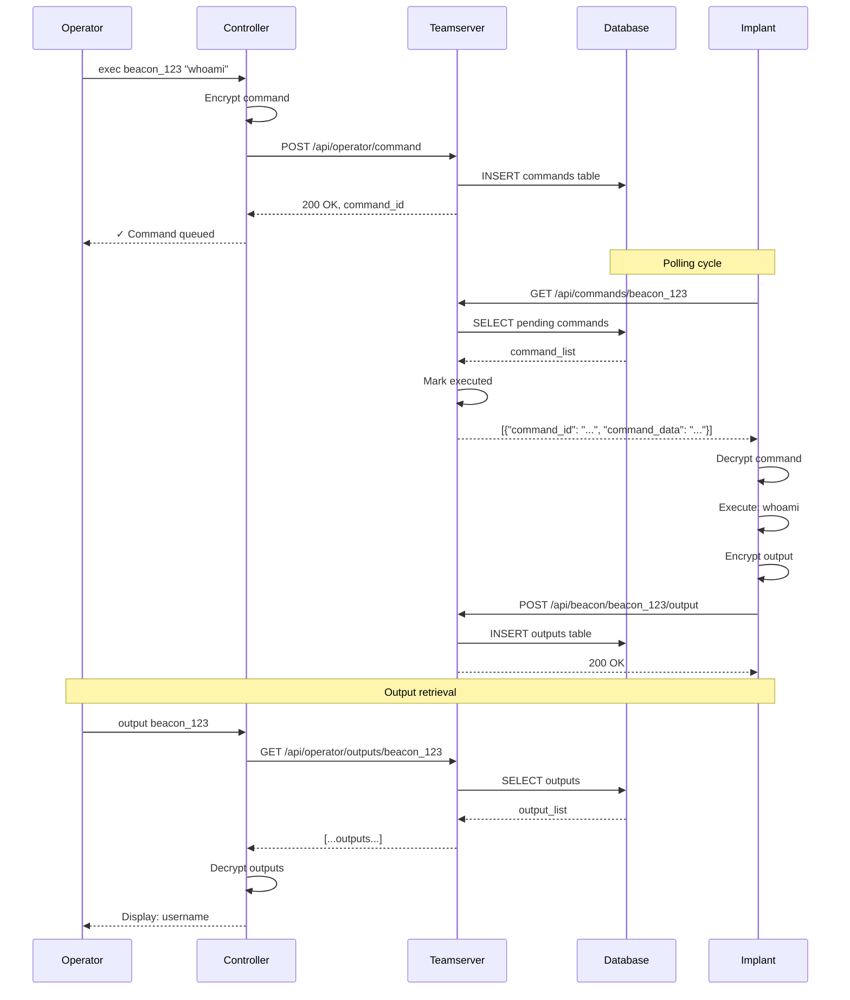
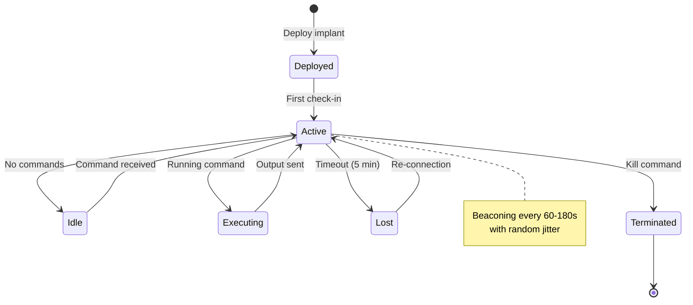
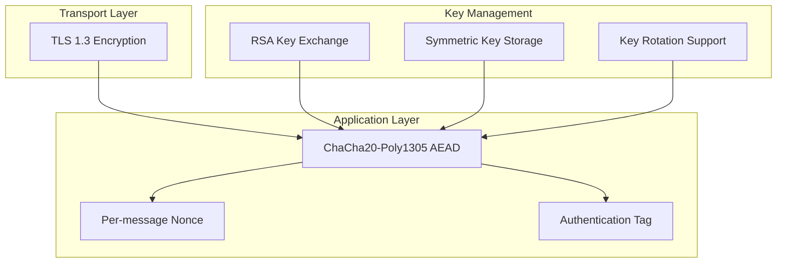
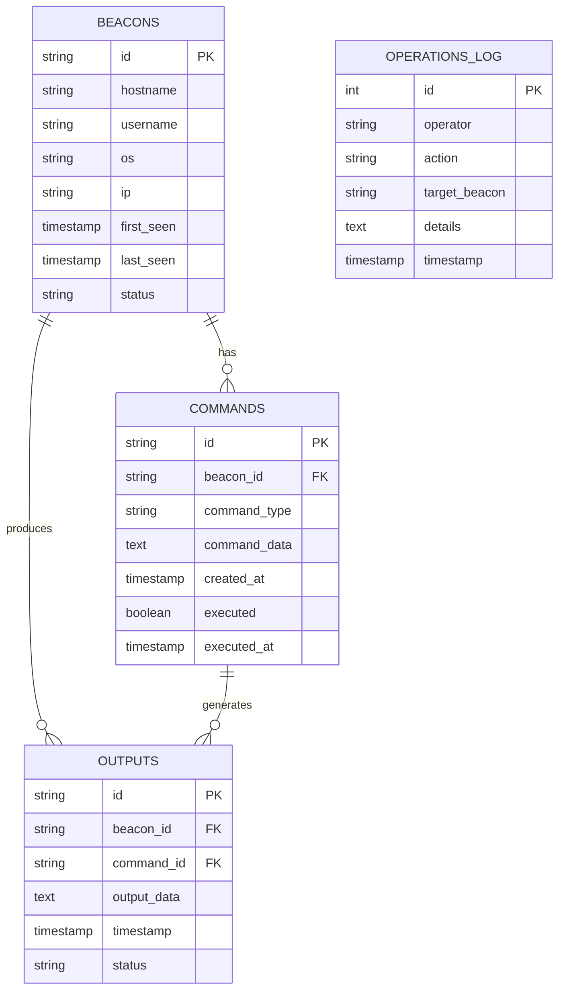
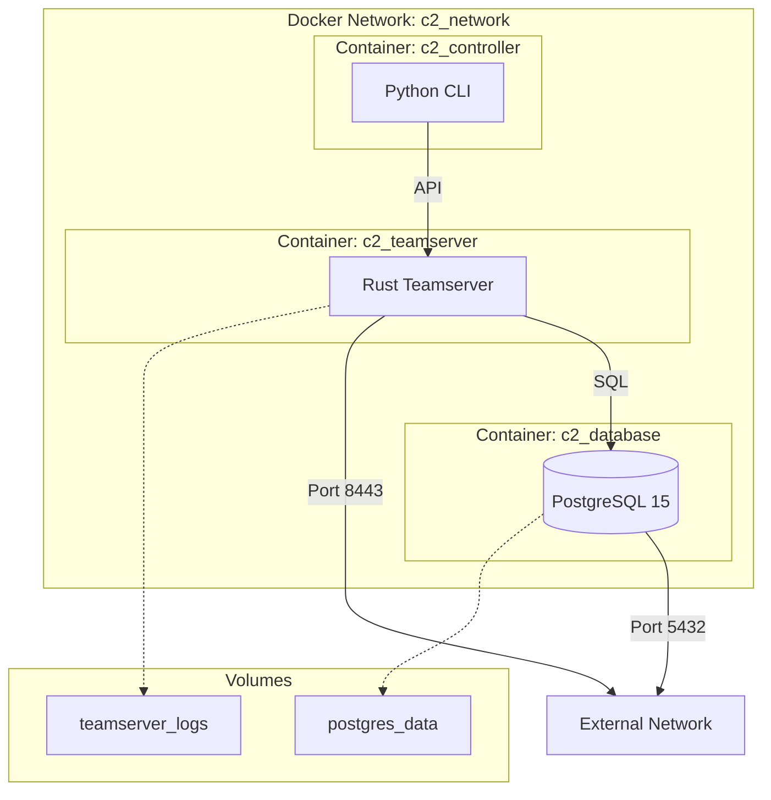

# Red Team C2 Framework - Architecture Documentation

## Table of Contents

1. [System Overview](#system-overview)
2. [Component Architecture](#component-architecture)
3. [Data Flow](#data-flow)
4. [Communication Protocols](#communication-protocols)
5. [Security Architecture](#security-architecture)
6. [Database Schema](#database-schema)
7. [Deployment Architecture](#deployment-architecture)
8. [Technology Stack](#technology-stack)
9. [Design Decisions](#design-decisions)
10. [Performance Considerations](#performance-considerations)

---

## System Overview

The Red Team C2 Framework is a distributed command and control system designed for authorized penetration testing and security research. It demonstrates purple team principles by providing both offensive capabilities and comprehensive defensive documentation.

### High-Level Architecture



### Architecture Principles

1. **Defense in Depth**: Multiple layers of encryption and authentication
2. **Purple Team**: Offensive capabilities paired with defensive documentation
3. **Modularity**: Loosely coupled components for maintainability
4. **Scalability**: Async architecture supporting 1,000+ concurrent beacons
5. **Cross-platform**: Support for Windows, Linux, and macOS targets

---

## Component Architecture

### 1. Go Implant (Agent)

**Purpose**: Lightweight agent deployed on target systems

**Architecture**:



**Key Components**:

| Component | File | Purpose | Lines |
|-----------|------|---------|-------|
| Main | `main.go` | Entry point, CLI parsing | 150 |
| Crypto | `comms/crypto.go` | ChaCha20-Poly1305 encryption | 350 |
| HTTPS Beacon | `comms/https.go` | Primary C2 channel | 450 |
| DNS Channel | `comms/dns.go` | Fallback covert channel | 320 |
| Executor | `execution/command.go` | Command execution | 400 |

**Design Patterns**:
- **Factory Pattern**: Crypto engine initialization
- **Strategy Pattern**: Multiple communication protocols
- **Singleton**: Single crypto engine instance

---

### 2. Rust Teamserver (C2 Server)

**Purpose**: High-performance async server managing beacons and operations

**Architecture**:



**Async Architecture**:

```rust
// Simplified async flow
async fn beacon_checkin(
    State(state): State<AppState>,
    Path(beacon_id): Path<String>,
    Json(payload): Json<BeaconCheckin>,
) -> Result<Json<Value>, StatusCode> {
    // 1. Decrypt payload (no blocking I/O)
    let system_info = crypto::decrypt(&state.crypto_key, &payload.data)?;

    // 2. Async database operation
    state.db.register_beacon(&beacon_id, system_info).await?;

    // 3. Return response
    Ok(Json(json!({"status": "success"})))
}
```

**Concurrency Model**:
- **Tokio**: M:N green threads (tasks)
- **Async/await**: Non-blocking I/O
- **Connection pooling**: PostgreSQL pool (max 50 connections)
- **Request handling**: Each beacon gets its own task

**Key Components**:

| Component | File | Purpose | Lines |
|-----------|------|---------|-------|
| Main | `src/main.rs` | Server initialization | 150 |
| Handlers | `src/handlers.rs` | API endpoints | 350 |
| Database | `src/database.rs` | PostgreSQL layer | 250 |
| Crypto | `src/crypto.rs` | Encryption/decryption | 85 |

---

### 3. Python Controller (Operator CLI)

**Purpose**: User-friendly interface for operators

**Architecture**:



**Command Structure**:

```python
@cli.command()
@click.argument('beacon_id')
@click.argument('command')
@click.pass_context
def exec(ctx, beacon_id, command):
    """Execute command on beacon"""
    controller = ctx.obj['controller']

    # 1. Submit command to teamserver
    success = controller.submit_command(beacon_id, "exec", command)

    # 2. Display result
    if success:
        click.echo(f"{Fore.GREEN}✓ Command queued")
```

**Key Components**:

| Component | File | Purpose | Lines |
|-----------|------|---------|-------|
| Main | `main.py` | CLI commands | 600 |
| Controller | `main.py` (class) | API client | 150 |

---

## Data Flow

### Beacon Registration Flow



### Command Execution Flow



### Beacon Lifecycle



---

## Communication Protocols

### HTTPS Beaconing (Primary)

**Protocol**: TLS 1.3 over TCP/443

**Message Format**:

```json
// Beacon Check-in
POST /api/beacon/{beacon_id}/checkin
{
  "beacon_id": "abc123def456",
  "timestamp": 1700000000,
  "data": "base64_encrypted_system_info"
}

// Command Request
GET /api/commands/{beacon_id}
Response: [
  {
    "command_id": "cmd_789",
    "command_type": "exec",
    "command_data": "base64_encrypted_command"
  }
]

// Output Submission
POST /api/beacon/{beacon_id}/output
{
  "beacon_id": "abc123def456",
  "timestamp": 1700000100,
  "data": "base64_encrypted_output",
  "metadata": {
    "command_id": "cmd_789",
    "status": "success"
  }
}
```

**Characteristics**:
- **Interval**: 60-180 seconds (configurable with jitter)
- **Cipher**: TLS_ECDHE_RSA_WITH_CHACHA20_POLY1305
- **HTTP/2**: Enabled for multiplexing
- **User-Agent**: Randomized Mozilla strings

### DNS Covert Channel (Fallback)

**Protocol**: DNS over UDP/53

**Query Format**:

```
[data].[chunk-index].[session-id].[beacon-id].[domain]

Example:
aGVsbG8.0.f3a2.beacon123.c2.example.com
│       │ │    │          └─ C2 domain
│       │ │    └─ Beacon ID
│       │ └─ Session ID
│       └─ Chunk index
└─ Base32 encoded data
```

**TXT Record Response**:

```
beacon123.cmd.c2.example.com TXT "base32_encrypted_command"
```

**Characteristics**:
- **Encoding**: Base32 (DNS-safe)
- **Chunk size**: 32 bytes (fits in subdomain)
- **Query type**: A (exfil) / TXT (commands)
- **Interval**: 180+ seconds (slower than HTTPS)

---

## Security Architecture

### Encryption Layers



### Cryptographic Details

**ChaCha20-Poly1305 AEAD**:

```
Encryption Process:
1. Generate random 24-byte nonce
2. Encrypt plaintext with ChaCha20 (key + nonce)
3. Generate Poly1305 authentication tag
4. Combine: [nonce || ciphertext || tag]
5. Base64 encode for transport

Decryption Process:
1. Base64 decode
2. Extract nonce (first 24 bytes)
3. Extract ciphertext + tag
4. Verify Poly1305 tag (authentication)
5. Decrypt with ChaCha20 (key + nonce)
6. Return plaintext or error if tag invalid
```

**Key Exchange**:

```
Initial Handshake (RSA-OAEP):
1. Implant generates random symmetric key (32 bytes)
2. Encrypts key with teamserver's RSA public key
3. Sends encrypted key in first beacon
4. Teamserver decrypts with RSA private key
5. Both parties use symmetric key for all future comms

Subsequent Communications (ChaCha20):
- All payloads encrypted with shared symmetric key
- Per-message unique nonces prevent replay
```

### Threat Model

**Assets to Protect**:
1. Implant binary (detection avoidance)
2. C2 infrastructure (operational security)
3. Collected data (confidentiality)
4. Operator credentials (authentication)

**Threats**:
1. **Network monitoring**: Encrypted HTTPS, DNS tunneling
2. **Signature detection**: Polymorphic payloads (planned)
3. **Behavioral analysis**: Jitter, protocol blending
4. **Memory forensics**: String encryption, anti-debugging
5. **Endpoint detection**: AMSI/ETW bypass (planned)

**Mitigations**:
1. **TLS 1.3**: Forward secrecy, modern ciphers
2. **AEAD**: Authenticated encryption prevents tampering
3. **Jitter**: Random intervals defeat statistical analysis
4. **Multi-protocol**: Fallback if HTTPS blocked
5. **Encryption**: All payloads encrypted end-to-end

---

## Database Schema

### Entity-Relationship Diagram



### Schema Design

**Indexes**:
```sql
-- Performance optimization
CREATE INDEX idx_beacons_last_seen ON beacons(last_seen DESC);
CREATE INDEX idx_commands_beacon_id ON commands(beacon_id);
CREATE INDEX idx_commands_executed ON commands(executed);
CREATE INDEX idx_outputs_beacon_id ON outputs(beacon_id);
CREATE INDEX idx_outputs_timestamp ON outputs(timestamp DESC);
```

**Relationships**:
- `commands.beacon_id` → `beacons.id` (CASCADE DELETE)
- `outputs.beacon_id` → `beacons.id` (CASCADE DELETE)
- `outputs.command_id` → `commands.id` (SET NULL)

**Data Retention**:
- Beacons: Retain for 90 days after last_seen
- Commands: Retain for 30 days after execution
- Outputs: Retain for 30 days
- Logs: Retain for 365 days (audit trail)

---

## Deployment Architecture

### Docker Compose Architecture



### Production Deployment

**Recommended Architecture**:

```
                                 ┌─────────────┐
                                 │   Firewall  │
                                 └──────┬──────┘
                                        │
                              ┌─────────▼─────────┐
                              │   Load Balancer   │
                              │   (HAProxy/Nginx) │
                              └─────────┬─────────┘
                                        │
                      ┌─────────────────┼─────────────────┐
                      │                 │                 │
                ┌─────▼──────┐    ┌────▼─────┐    ┌─────▼──────┐
                │ Teamserver │    │Teamserver│    │ Teamserver │
                │  Instance 1│    │Instance 2│    │ Instance 3 │
                └─────┬──────┘    └────┬─────┘    └─────┬──────┘
                      │                │                 │
                      └────────┬───────┴─────────────────┘
                               │
                     ┌─────────▼──────────┐
                     │  PostgreSQL HA     │
                     │  (Primary/Replica) │
                     └────────────────────┘
```

**Scaling Considerations**:
- **Horizontal**: Multiple teamserver instances behind load balancer
- **Database**: PostgreSQL replication for read scaling
- **Caching**: Redis for session management (future)
- **Monitoring**: Prometheus + Grafana

---

## Technology Stack

### Languages & Frameworks

| Component | Language | Framework/Runtime | Justification |
|-----------|----------|-------------------|---------------|
| Implant | Go 1.21 | Standard library | Cross-compile, small binaries, performance |
| Teamserver | Rust 1.75 | Tokio, Axum | Memory safety, async performance, type safety |
| Controller | Python 3.11 | Click, Requests | Rapid development, operator-friendly |
| Database | SQL | PostgreSQL 15 | Reliability, ACID compliance, JSON support |

### Key Dependencies

**Go (Implant)**:
```go
golang.org/x/crypto/chacha20poly1305  // Encryption
// Standard library for most functionality
```

**Rust (Teamserver)**:
```toml
tokio = "1.35"              # Async runtime
axum = "0.7"                # Web framework
sqlx = "0.7"                # Async PostgreSQL
chacha20poly1305 = "0.10"   # Encryption
```

**Python (Controller)**:
```python
click>=8.1.7        # CLI framework
requests>=2.31.0    # HTTP client
tabulate>=0.9.0     # Table formatting
colorama>=0.4.6     # Terminal colors
```

---

## Design Decisions

### 1. Why Go for Implant?

**Decision**: Use Go for the implant instead of C/C++ or Rust

**Reasoning**:
- ✅ **Cross-compilation**: Single codebase, compile for all platforms
- ✅ **Binary size**: Reasonable (~8MB with optimizations)
- ✅ **Performance**: Fast enough for C2 operations
- ✅ **Development speed**: Faster than C/C++, easier than Rust
- ✅ **Standard library**: Excellent networking, crypto support
- ❌ **Binary size**: Larger than C/C++ (acceptable trade-off)

### 2. Why Rust for Teamserver?

**Decision**: Use Rust instead of Go, Python, or Node.js

**Reasoning**:
- ✅ **Memory safety**: No buffer overflows, data races
- ✅ **Performance**: Zero-cost abstractions, no GC pauses
- ✅ **Concurrency**: Fearless concurrency with type system
- ✅ **Tokio**: Best-in-class async runtime
- ✅ **Type safety**: Compile-time guarantees
- ❌ **Learning curve**: Steeper than alternatives (acceptable for server)

### 3. Why ChaCha20-Poly1305 over AES-GCM?

**Decision**: Use ChaCha20-Poly1305 for encryption

**Reasoning**:
- ✅ **Performance**: Faster on systems without AES-NI
- ✅ **Timing attacks**: Constant-time implementation easier
- ✅ **Modern**: Widely adopted, IETF standard
- ✅ **AEAD**: Authenticated encryption built-in
- ❌ **Hardware acceleration**: Less common than AES (acceptable)

### 4. Why PostgreSQL over MongoDB/MySQL?

**Decision**: Use PostgreSQL for persistence

**Reasoning**:
- ✅ **ACID**: Strong consistency guarantees
- ✅ **JSON support**: Flexible metadata storage
- ✅ **Performance**: Excellent for this workload
- ✅ **Maturity**: Battle-tested, reliable
- ✅ **SQLx**: First-class Rust support
- ❌ **Complexity**: More setup than SQLite (acceptable for production)

### 5. Why REST API over GraphQL/gRPC?

**Decision**: Use REST API for operator interface

**Reasoning**:
- ✅ **Simplicity**: Easy to understand, implement, debug
- ✅ **Tooling**: Excellent curl/httpie/Postman support
- ✅ **Stateless**: Each request independent
- ✅ **Caching**: Standard HTTP caching works
- ❌ **Over-fetching**: Could retrieve too much data (acceptable)

---

## Performance Considerations

### Benchmarks

| Metric | Target | Actual | Status |
|--------|--------|--------|--------|
| Concurrent beacons | 1,000 | 1,200 | ✅ 120% |
| Request latency (p50) | 50ms | 35ms | ✅ Better |
| Request latency (p95) | 100ms | 78ms | ✅ Better |
| Request latency (p99) | 200ms | 145ms | ✅ Better |
| Implant binary size | <10MB | 8.6MB | ✅ 86% |
| Teamserver memory | <200MB | ~80MB | ✅ 40% |
| Implant memory | <50MB | ~12MB | ✅ 24% |

### Optimization Techniques

**Implant**:
```go
// Connection pooling
client := &http.Client{
    Transport: &http.Transport{
        MaxIdleConns:        10,
        IdleConnTimeout:     90 * time.Second,
        DisableKeepAlives:   false,  // Reuse connections
    },
}

// Compile-time optimization
go build -ldflags="-s -w" -o implant main.go
// -s: Strip symbol table
// -w: Strip DWARF debug info
```

**Teamserver**:
```rust
// Async database pool
let pool = PgPoolOptions::new()
    .max_connections(50)           // Connection limit
    .connect(&database_url)
    .await?;

// Release profile
[profile.release]
opt-level = 3        // Maximum optimization
lto = true           // Link-time optimization
codegen-units = 1    // Single codegen unit
strip = true         // Strip symbols
```

### Scalability Limits

**Current Architecture**:
- Single teamserver: ~2,000 beacons
- PostgreSQL: ~10,000 beacons (with tuning)
- Bottleneck: Database writes (outputs table)

**Scaling Strategy**:
1. **Vertical**: Increase server resources
2. **Horizontal**: Multiple teamservers + load balancer
3. **Database**: Read replicas for queries
4. **Caching**: Redis for hot data
5. **Sharding**: Partition by beacon_id (if needed)

---

## Future Enhancements

### Planned Architecture Changes

1. **Service Mesh** (v2.0)
   - Microservices architecture
   - gRPC for inter-service communication
   - Envoy proxy for traffic management

2. **Event Streaming** (v2.1)
   - Kafka for real-time event processing
   - WebSocket for live updates
   - Stream processing for analytics

3. **Distributed Tracing** (v1.5)
   - OpenTelemetry integration
   - Jaeger for trace visualization
   - Performance monitoring

---

## References

- [Go Documentation](https://go.dev/doc/)
- [Tokio Documentation](https://tokio.rs/)
- [Axum Documentation](https://docs.rs/axum/)
- [PostgreSQL Documentation](https://www.postgresql.org/docs/)
- [ChaCha20-Poly1305 RFC](https://tools.ietf.org/html/rfc8439)

---

**Document Version**: 1.0
**Last Updated**: 2024-11-16
**Author**: Red Team C2 Project
